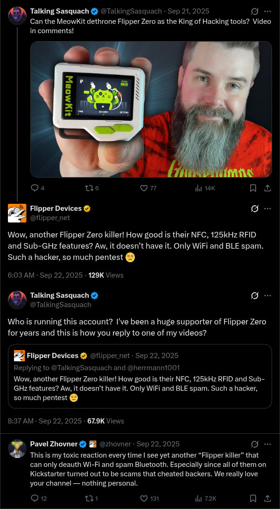
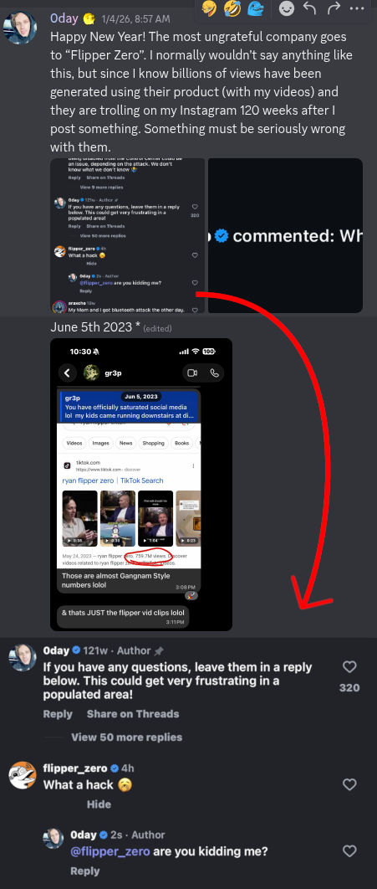
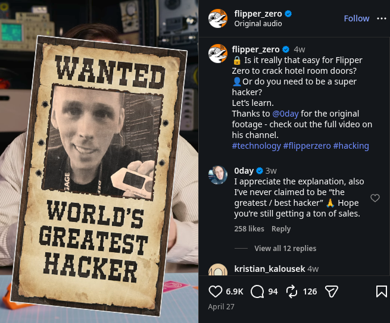
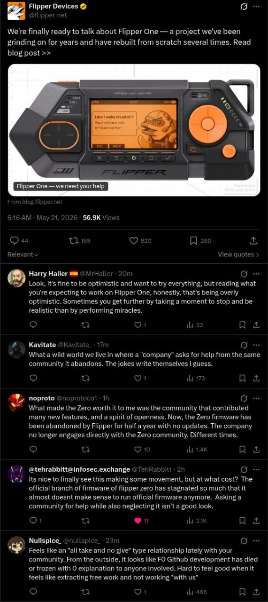

### Update (6/17/2026)
It seems efforts are being made to have the Flipper Devices community become community led and not under corporate control.
There was an attempt at a global ping within the Flipper Devices discord by some individual, and before it was removed, it contained this:

> Hey Flipper fans, join us in this move to a cool NEW community server!
With recent non-ideal corporate changes in direction, the community has decided to take action. Now announcing THE new independent server built by the community, for the community!
It’s a fresh home where creators, developers, and experts actually come first. 
The aim is simple: provide a space to work together freely, allowing for a wider variety of knowledge to be shared!
Ready to learn more, chat more, and get involved? Join below!
https://discord.gg/vUVK5naagd

The messaging I wholly support, even if the methods were a bit over the top to send it. I think anyone looking to get into the ecosystem should certainly consider this server!

## Background Knowledge
[Flipper Devices](https://flipperdevices.com) is the company behind the viral and well known open source tech gadget known as the [Flipper Zero](https://flipper.net) that began shipping in 2022.
In order to get community engagement and real time feedback, as well as foster an environment where people would make tools for the Flipper Zero, the company set up both an English-speaking Discord server and Russian-speaking Telegram community. It became quickly apparent that the Discord server would be much larger than the Telegram community. Between 2022 and early 2024, staff at most levels were active at least once a week in these communities. This included developers, artists, and community managers. Participation by staff I feel genuinely has helped kick off community code contributions, artwork, and application development for the device. 

I also want to make something very clear here going forward: **The Flipper Devices developers are NOT the target of any blame in the events below.**

In most companies, developers are not the ones making decisions that lead to outcomes like this. Instead, they are simply victims to project management, resource allocation, and planning of the people above them. This is almost certainly a failure of project and community management by their C-Suite. 

## The Decline
As time went on, active staff engagement with the community started slowly declining. Any of the non-technical community managers that Flipper Devices employed were mostly there to oversee simple housekeeping activities such as spam removal, rules compliance, and basic support for shipment issues or device support tickets. Their scope was fairly limited. This however initially wasn't a 'huge' problem. Code contributions could still be submitted and accepted in the Github codebases the company maintained. One of the developers who enjoyed social interaction also set out to do his best to hold a Questions & Answers session after the release of each notable Flipper Zero firmware update. 

This at least provided the community with a periodic opportunity to get highly technical questions answered. Unfortunately this too was not something that would last. The developer hosting these events left at the end of Feb. 2025, right around when Flipper Devices decided to focus their development team into getting the Busy Bar's firmware and hardware in a good state for an eventual retail sales release. Many felt that the Busy Bar itself was a massive departure from the original direction of the company which made its name with its original tech gadget multi-tool, and it was disappointing that it appeared that staff were pulled away from the community to work on this project and possibly other projects in the background. 

The departure of one of the founding developers, which was the same one that ran the questions and answers event, also raised a lot of questions within the community. After that departure, releases began slowing down for the device. This eventually culminated in the very last release done, 1.4.3, being purely a [minor bugfix](https://github.com/flipperdevices/flipperzero-firmware/releases/tag/1.4.3). From the community's perspective, it felt like we were simply left to our own devices with no direct line of communication of what was happening internally. We could only speculate that development and community resources were pulled into another project, with our only guess being potentially the Busy Bar. 

## The Problems Begin
With the pull back away from the community and focus on other projects, other problems began to appear a few months into 2026:
- The Flipper Zero Firmware no longer had manpower to accept new contributions/pull requests
- The Flipper Zero Application Catalog no longer had anyone to approve new apps, which led to new apps being blocked from release as well as existing apps being held back to older prior approved versions. 

It took a few months, but the app catalog problem was eventually mediated by giving access to Flipper Devices' app catalog to one of the long time developers in the community. This at least allowed apps to progress once more.
Unfortunately, the issues with the Flipper Zero still persist at the time of this article's writing, and [6 months have elapsed since the last update](https://github.com/flipperdevices/flipperzero-firmware/releases/tag/1.4.3). Pull requests from long time contributors have likewise have been [frozen for an equal amount of time](https://github.com/flipperdevices/flipperzero-firmware/pull/4323). 

These issues have continued to persist without Flipper Devices stating their intentions with the Flipper Zero codebase and the community is simply left to wonder if the project has reached end of support or if development is simply temporarily frozen. No information has been shared on if or how they plan to transition the firmware to be community led. ***Any*** communication would allow for the community to have clarity and plan accordingly. 

On the social media side, problems also began appearing regarding their community. One of the content makers that popularized usage of the Flipper Zero, who had prior provided many quality videos and guides for using the device, suddenly got this negative interaction from Flipper Devices and their CEO, Pavel Zhovner:

It is poor form to use high profile accounts to simply make fun of other products and projects outside of your own. I think most people would understand that this is just flat out very poor form in the public relations space. 
Simply saying "nothing personal" does not absolve the negative damage done in public view. This, unfortunately, was only the first of such incidents....

Some context is required to grasp this event. 0day is a social media personality that runs tech focused content, showcasing different capabilities of the device. They typically end up being some level of over dramatic and may give the impression in the videos that the device is capable of more powerful hacking than it otherwise realistically would be, which is, for better or worse, the kind of the content you have to push if you want mass appeal and attention. You can think what you want of such videos, but one cannot deny that they are getting clicks and eyeballs. Such content also has likely had measurable positive impact on the sales of the device as well. 

Influencers need to eat too, and they tend to steer towards what gets them views when on their own. Instead of simply responding "What a hack" like Flipper Devices did here, they could have recognized that such people simply follow the money. In a different timeline, Flipper Devices would have instead opted to form a partnership with such individuals, and this would have allowed them to somewhat influence the content direction while the social media personality gets some pay for their trouble as well. Instead, a bridge was burned with this individual by just resulting to low effort insults. 

No lessons were learned here by the employees, as they later took aim once again at 0day in an [Instagram video](https://www.instagram.com/p/DXpI9xEgnmo/). It is apparent here that while they credit him for his content that was used, he was entirely unaware *how* they would use that content in their own videos.

It is apparent that Flipper Devices just does not have any public relations strategy, and seem to ignore any pushback their community gives them for their actions. 

## The Flipper One and An Outcry From The Community
Understandably, after being left with no communication within Discord or Telegram as well as seeing the public social media accounts act poorly to the people who have stuck around all these years, the community was not happy with how things were being ran. These emotions were especially evident when Flipper Devices [launched their post regarding the Flipper One](https://blog.flipper.net/flipper-one-we-need-your-help/), which was a call from help from the community to work on tasks related to the device. I think many felt like after being ignored, this felt less like them asking for help and more like the company was asking for free labor. 

It was no surprise when the post on X regarding the Flipper One development was met with considerable pushback from long time community members. 

After this backlash, Flipper Devices has become completely silent on their social media platforms. They have also not come to the table to talk to any of their active social communities, with the largest being on Discord, at about 110k members. Despite linking to the discord on the post requesting help from the community, new members quickly discover the Discord server simply does not have *any* staff from Flipper Devices reading it. Those who want to talk through ideas for the Flipper One or ask where best to contribute to the project are entirely unable to do so. I am still uncertain why they would link such chat platforms in their own post if they did not have plans to appropriately staff them.
New joins hoping to contribute code or technical advice to the Discord server have also noticed that the server is devoid of active staff and have opted to go spend their efforts elsewhere. 

## A Call To Action
I think most long time community members in this space wish these things were not the case. They also have a bit of hope, however small, that maybe things will get better. 
We hope that Flipper devices will consider the following items:
- Provide better communication with their community, providing more concise plans for their current projects and how they will transition to future projects.
- Address how the existing products will be handled as they reach end of support, while also keeping the community in mind.
- Stop attacking or making fun of influencers/creators in the social media space.
- Rethink their social media strategy by improving public relations and also considering sponsorships in order to steer content to their favor from other creators. 
- Find ways to invest and give back to the existing community, instead of simply treating it like a resource that only exists to be strip-mined of free labor. 

Will Flipper Devices acknowledge these things? Will any of this drive them to re-evaluate their direction? I cannot say at this stage. I hope that where we are in May of 2026 will not be where we are in the future months.

My hope is that this information brings people up to speed with the current dealings of Flipper Devices and educate people to the poor support and one-sided extraction Flipper devices performs regarding their community. If we are lucky, hopefully one day this page will be updated with positive news about how the company was able to turn around and make it more attractive for their community. That being said, don't hold your breath.